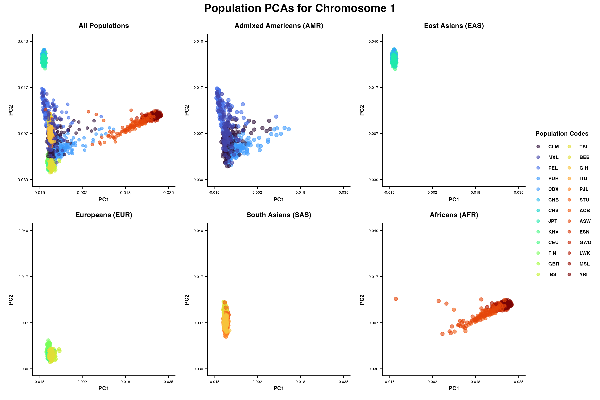

# Project Overview

This project explores population genetic structure using whole genome sequencing data from the 1000 Genomes Project (NHLBI high-coverage resequencing, 3,202 samples across 26 populations). Starting from biallelic SNP VCF files for chromosomes 1 and 10, variants are filtered for common alleles (MAF > 1%) and converted to GDS format for analysis in R. Principal component analysis (PCA) is then performed to visualize genetic diversity across five continental superpopulations (African, Admixed American, East Asian, European, and South Asian), with both individual-level scatter plots and population mean plots generated for comparison. The project additionally calculates pairwise FST between populations to quantify genetic differentiation.

### Repository Structure 

```
├── data
│   ├── processed
│   └── raw
├── README.md
├── results
│   ├── figures
│   ├── pca_chr1.rds
│   └── pca_chr10.rds
└── scripts
    ├── 01_vcf_filter
    ├── 02_vcf_to_gds.R
    └── 03_pca_plotter.R
...
```
## Whole Population PCA Plots Chromosome 1 



## Whole Population PCA Plots Chromosome 10 


## Mean Population PCA Plots Chromosome 1 


## Mean Population PCA Plots Chromosome 10 

