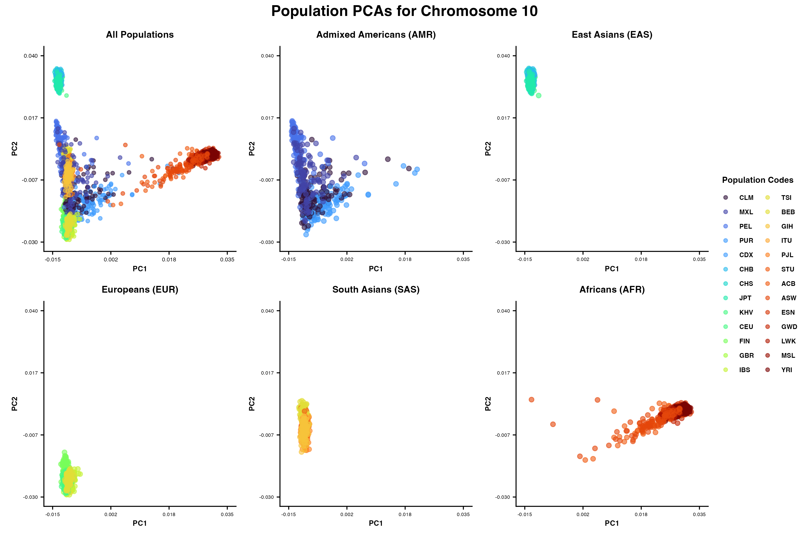
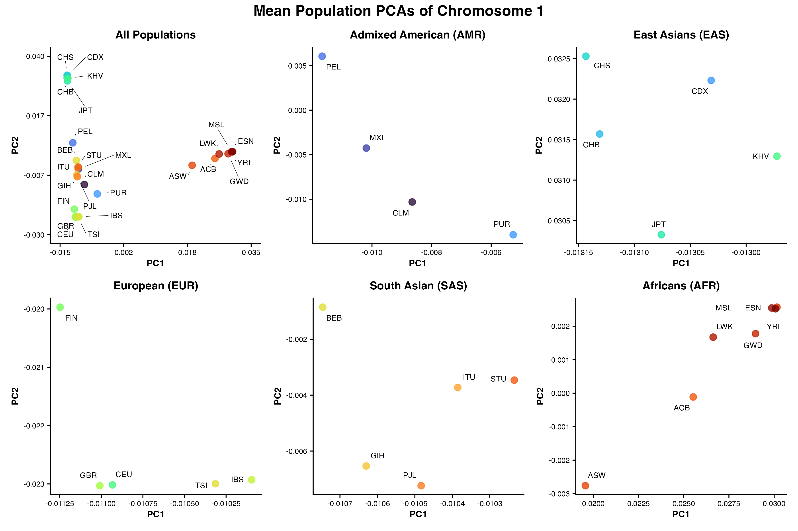
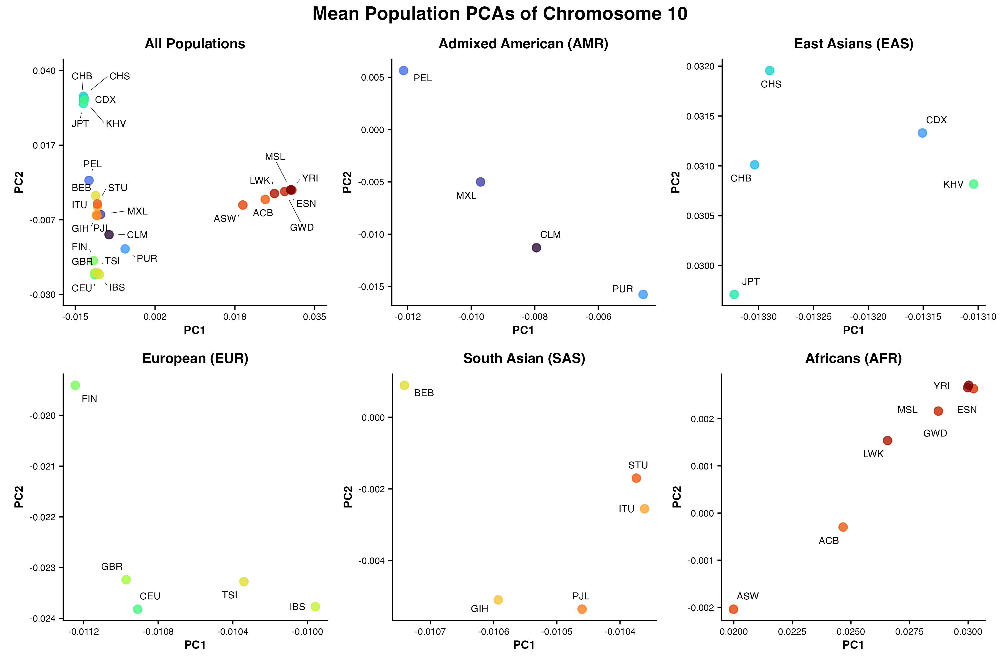

# Project Overview

This project explores population genetic structure using whole genome sequencing data from the 1000 Genomes Project (NHLBI high-coverage resequencing, 3,202 samples across 26 populations). Starting from biallelic SNP VCF files for chromosomes 1 and 10, variants are filtered for common alleles (MAF > 1%) and converted to GDS format for analysis in R. Principal component analysis (PCA) is then performed to visualize genetic diversity across five continental superpopulations (African, Admixed American, East Asian, European, and South Asian), with both individual-level scatter plots and population mean plots generated for comparison. The project additionally calculates pairwise FST between populations to quantify genetic differentiation.

### Repository Structure 

```
├── data
│   ├── processed
│   └── raw
├── README.md
├── results
│   ├── figures
│   ├── pca_chr1.rds
│   └── pca_chr10.rds
└── scripts
    ├── 01_vcf_filter
    ├── 02_vcf_to_gds.R
    └── 03_pca_plotter.R
...
```
## Whole Population PCA Plots Chromosome 1 


PCA of 3,202 individuals across 26 populations using common biallelic SNPs from chromosome 1. Each point represents one sample, coloured by population code. Superpopulation-level plots show within-group spread along PC1 and PC2.

## Whole Population PCA Plots Chromosome 10 



PCA of 3,202 individuals using common biallelic SNPs from chromosome 10. Population clustering patterns are broadly consistent with chromosome 1, supporting the robustness of the observed structure across different genomic regions.

## Mean Population PCA Plots Chromosome 1 



Mean PC1 and PC2 values per population for chromosome 1. Each point represents the centroid of one population, with zoomed axes per superpopulation to resolve fine-scale separation between closely related groups.

## Mean Population PCA Plots Chromosome 10 



Mean PC1 and PC2 values per population for chromosome 10. Superpopulation-level panels reveal subpopulation relationships consistent with those observed on chromosome 1, with minor differences in spread reflecting regional variation in linkage and diversity.